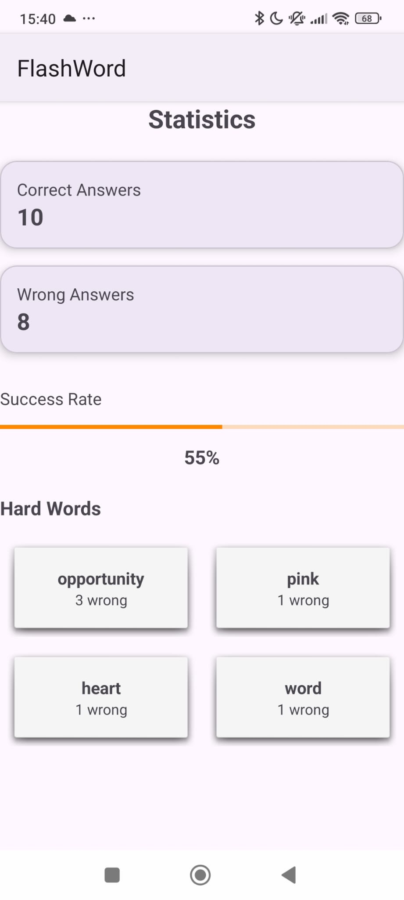
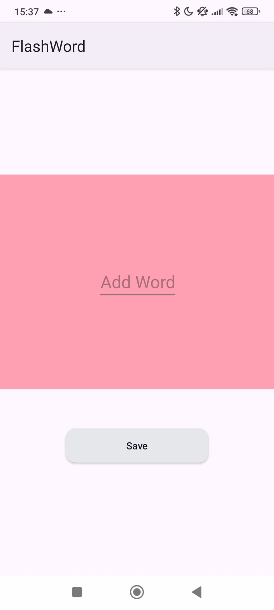
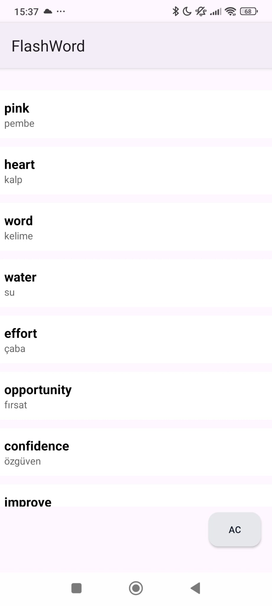

# FlashWord

FlashWord is a simple and user-friendly English–Turkish vocabulary learning Android application built to help users improve their word knowledge through flashcards, quizzes, and statistics.

The app focuses on clean UI, ease of use, and motivation-based learning features such as streak tracking and performance analysis.

## Screenshots

## Features
- Add and manage words
- Offline storage with Room
- Clean and simple UI

## Tech Stack
- Java
- Android Studio
- Room Database
